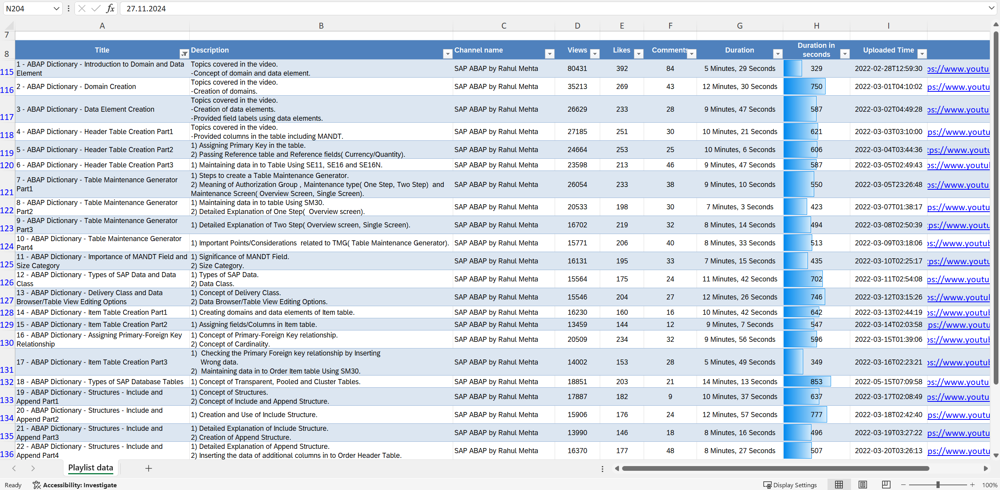

# ABAP ALV
This is my practice work for learning ABAP Language concepts: topic of ABAP List Viewer (ALV)

## Planning the study work
Feel free to use the Excel Workbook uploaded in this repository

